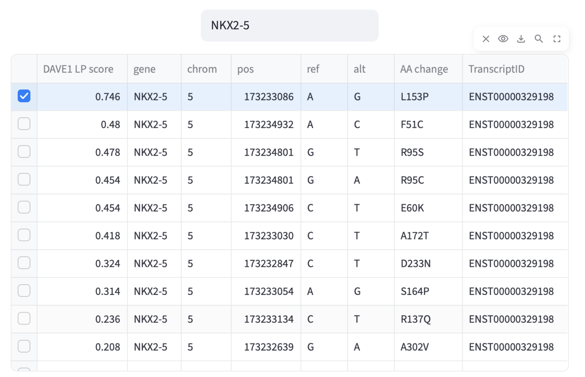
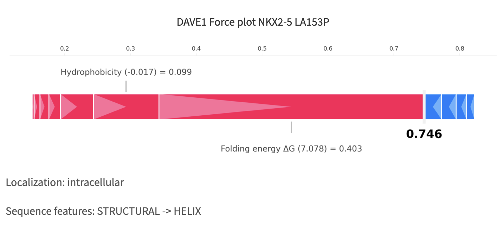

# 🧬 DAVE1 VKGL VUS Pathogenicity Viewer

This Streamlit app provides an interactive interface for exploring DAVE1 pathogenicity predictions of Variants of Uncertain Significance (VUS) from the VKGL consensus datasharing. It integrates data visualization, protein structure modeling, and molecular feature analysis to support variant interpretation in a clinical genomics context.

Our article is now in preprint! DOI: xxxx.xx.xx.xx

---

## 🚀 Features

- 🔍 Searchable and filterable VUS table from VKGL dataset
- 📊 Force plot visualization of DAVE1 LP score contributions
- 🧬 Protein structure modeling with FoldX
- 🧪 3D visualization of wild-type and mutant proteins using Py3Dmol

---

## 📁 File Requirements

Ensure the following files and directories are present in the working directory:

- `vkgl_apr2024_VUS_pred.csv`: VUS prediction data downloaded from the dave1 resources
- `foldx/foldx5_1Linux64/foldx_20251231`: FoldX executable
- `AF_pdb/AF-<UniProtID>-F1-model_v4.pdb.gz`: AlphaFold PDB files version 4 FTP: 

---

## 🧪 Installation

Install required Python packages:

```bash
pip install streamlit matplotlib pandas numpy py3Dmol plotly

```

## Example NKX2-5 L153P:





